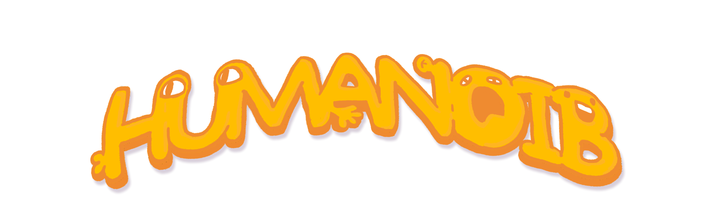
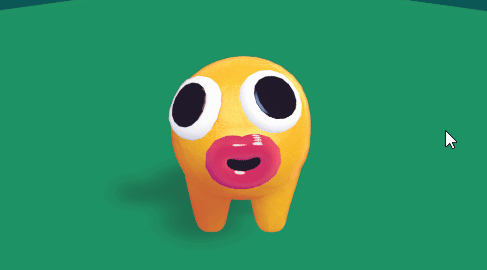

**Oddlark** is an ultra small and experienced video game development team based in Naarm (_Melbourne, Australia_) with a focus on sustainably ***'creating quality oddities'*** with small scope and large impact.

**Oddlark's** first title will be **HUMANOIB**, a game that explores a singular
concept: “**_Character Creation as Gameplay_**”.

Your creations, named **Noibs**, will be crafted
out of jumbles of body parts to compete against other creations in
“**_Flesh-Child Beauty Pageants_**” to seek and gain maximum
approval from your Dad, the Universe.

_**HUMANOIB** is a modern indie re-imagining of the **_Spore
Creature Creator_** featuring _Asynchronous
Multiplayer_ and inspired by the strategic
gameplay of the _Auto-Battler_, _Deck Building_ and _Creature
Combat_ genres._